# Metal Arm Assembly Guide

This is the assembly guide for the Metal Arm hardware.

## Step 1: Unbox the Kit

Open the shipping box and remove the top foam layer. The kit should look similar to the photo below.

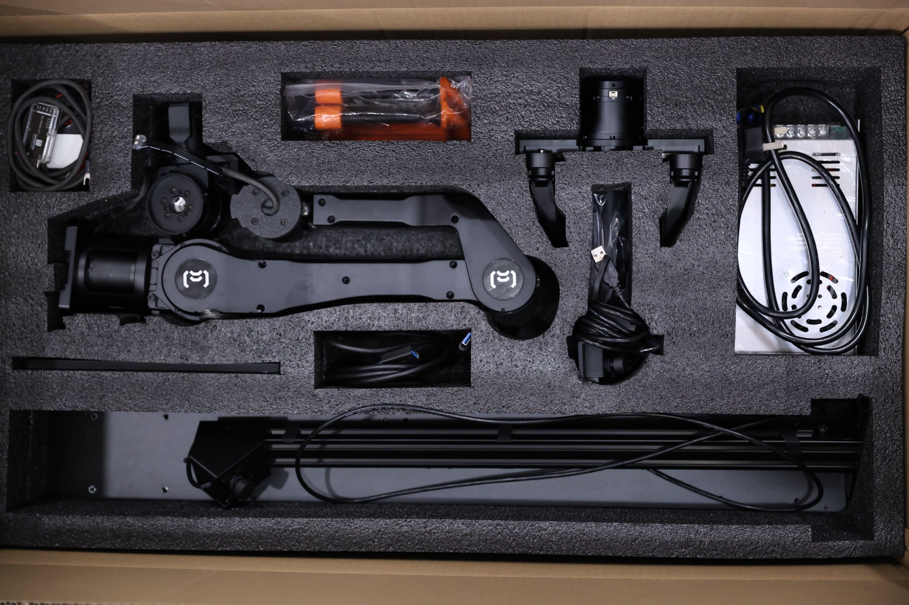

After unboxing, check that you have the following parts:

- Metal arm, x1
- Gripper, x1
  - The gripper may vary depending on your configuration.
  - Some configurations include a handle, and some do not.
- Clamps, x2
- Stop button with CAN USB dongle, x1
- Power supply, x1
- Camera, x1
- Camera 3-pin to USB cable, x1
- Base plate for mounting, x1
  - If you purchased the leader-follower package, your kit includes a longer base plate that can mount two arms.
- Front camera stand, x1
- Front camera, x1
- Front camera 3-pin to USB cable, x1
- Bag of screws, hex keys, and extra cable, x1

If anything is missing or damaged, stop here and contact support before continuing with the assembly.

## Step 2: Clamp the Base Plate to the Table

Place the base plate along the front edge of the table, then use the two clamps to secure it firmly to the tabletop.

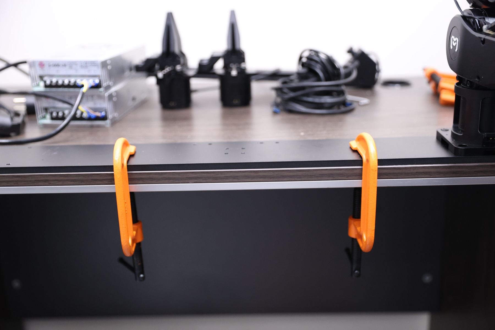

Make sure the side with the four extra holes in a straight line faces toward the inner side of the table. The four holes arranged as a square should stay near the middle of the base plate.

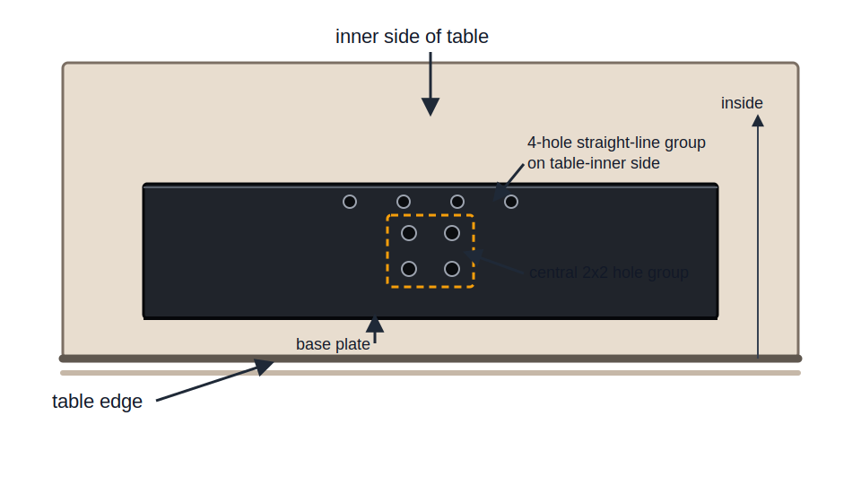

Before continuing, check that:

- The base plate sits flat on the tabletop.
- Both clamps are tightened evenly.
- The side with the four extra holes in a straight line faces the inner side of the table.
- The arm mounting position remains accessible after clamping.

## Step 3: Mount the Metal Arm

Place the metal arm onto the arm mounting position on the base plate. Orient the arm so the motor cable faces toward the inner side of the table.

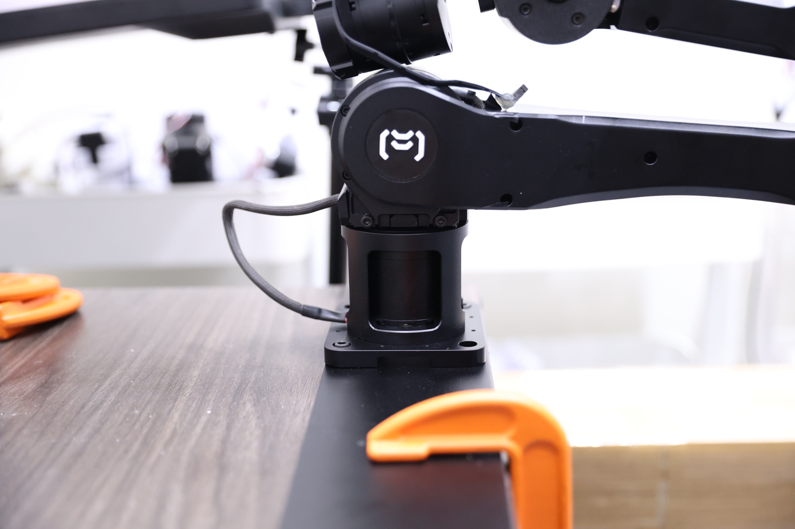

Before tightening the mounting screws, check that:

- The arm base is seated flat on the base plate.
- The mounting holes are aligned.
- The motor cable exits toward the inner side of the table.
- The cable is not pinched under the arm base.

Once the orientation is correct, tighten the mounting screws evenly.

## Step 4: Mount the Gripper

If this arm will be used as the leader arm, mount the leader handle before installing the gripper.

Align the gripper with the end of the metal arm. The white bar on the gripper should line up with the bottom of the gripper before you tighten it in place.

| Align the gripper | Secure the mounting screws |
| --- | --- |
| 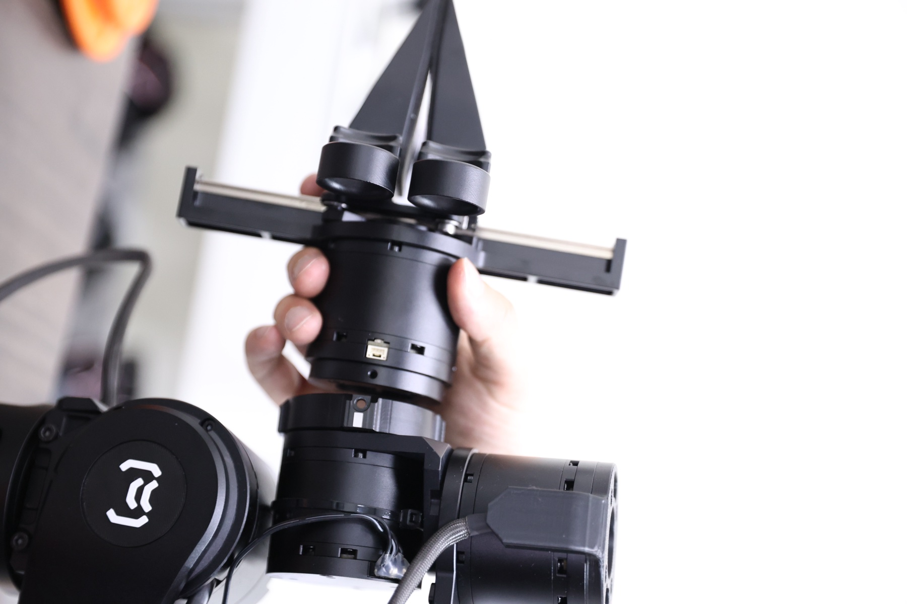 | 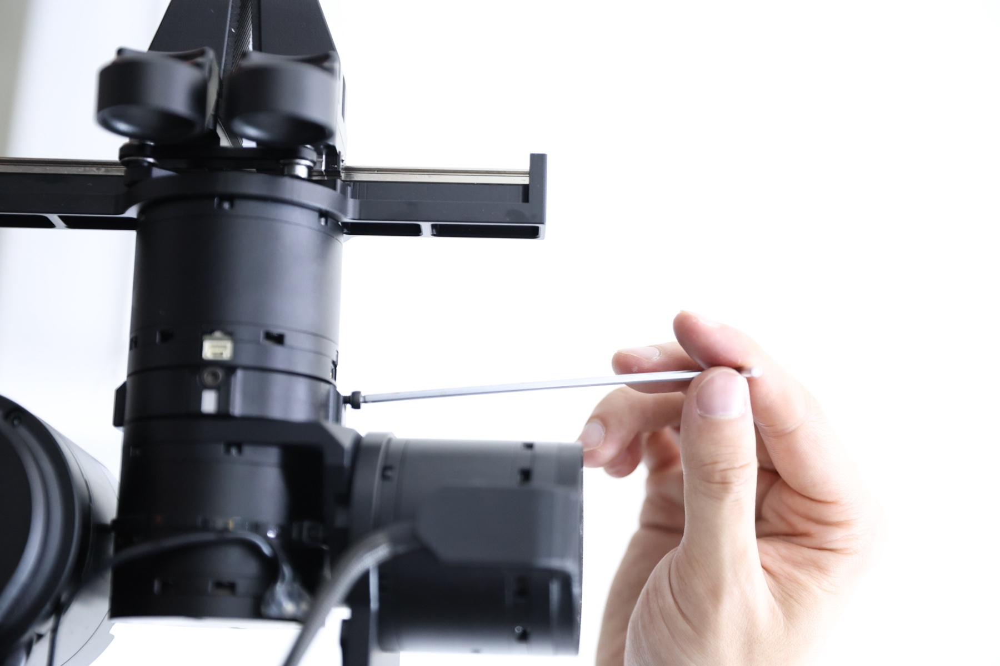 |

Before tightening the gripper, check that:

- The gripper is fully seated on the end of the arm.
- The white bar is aligned with the bottom of the gripper.
- The gripper can move freely without rubbing against the arm.
- Any leader handle parts are already installed if this is the leader arm.

Once the alignment is correct, use the hex key to tighten the gripper mounting screws evenly.

## Step 5: Mount the Camera on the Gripper

Place the camera on top of the gripper and align the camera mounting holes with the holes on the gripper body.

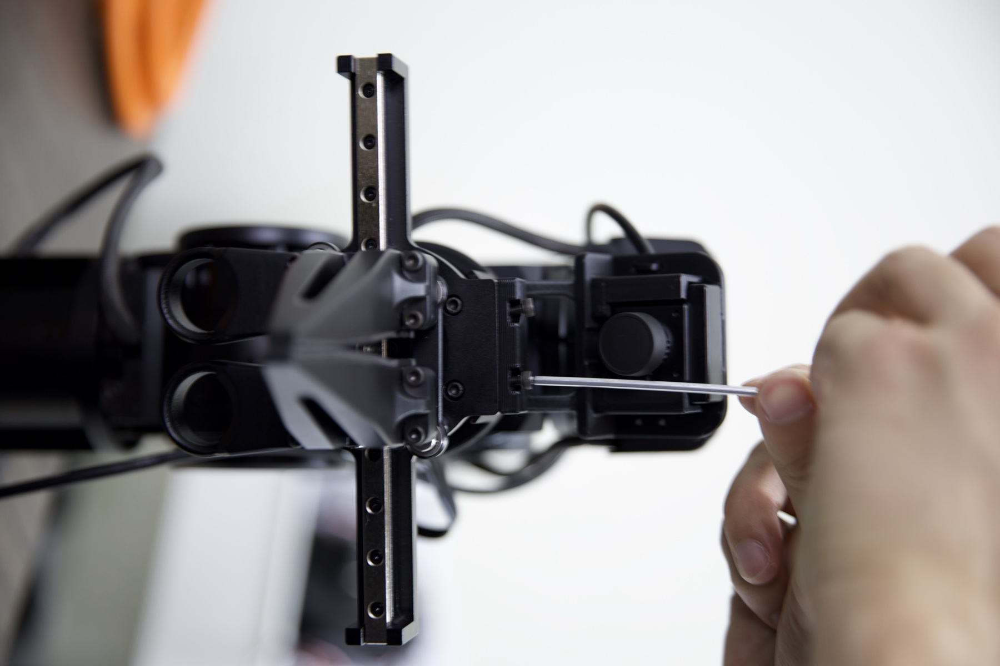

Secure the camera with the included screws. Tighten the screws evenly so the camera sits flat and does not tilt.

Before continuing, check that:

- The camera is seated on top of the gripper.
- The camera mounting holes are aligned with the gripper holes.
- The screws are tightened evenly.
- The camera cable path is clear and does not interfere with gripper movement.

## Step 6: Mount the Front Camera Stand

Place the front camera stand onto the front camera stand mounting holes on the base plate.

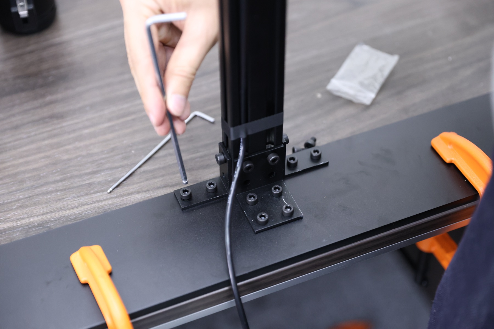

Secure the stand with the included screws. Tighten the screws evenly so the stand stays vertical and does not shift on the base plate.

Before continuing, check that:

- The stand base is seated flat on the base plate.
- The stand is aligned with the mounting holes.
- All mounting screws are installed and tightened evenly.
- The stand is stable when lightly touched.

## Step 7: Connect Power and CAN Bus to the Arm

Plug the power and CAN bus cable into the port on the back of the metal arm.

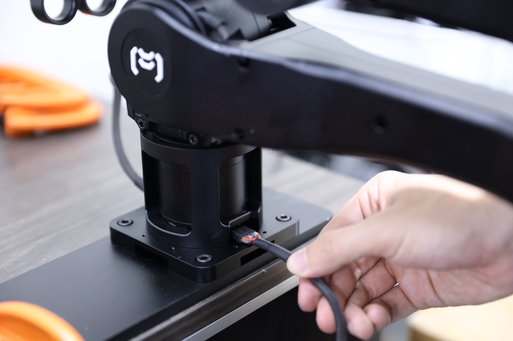

The other end of this cable should be attached to the CAN bus USB dongle and the power button assembly.

Before continuing, check that:

- The connector is fully seated in the back of the metal arm.
- The cable is connected to the CAN bus USB dongle.
- The cable is connected to the power button assembly.
- The cable has enough slack for arm movement and is not pinched under the base.

## Step 8: Secure the Power and Ground Terminals

Make sure the power supply is unplugged before working on the terminal block.

Secure the power and ground terminals to the power supply terminal block as shown below.

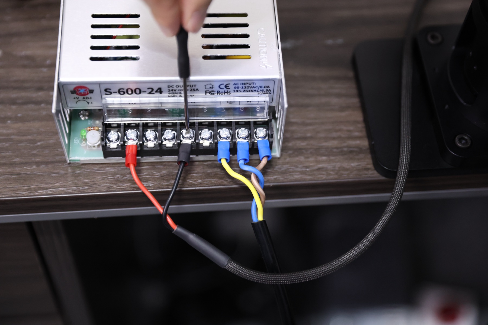

Before continuing, check that:

- The positive power terminal is secured in the correct power output position.
- The ground terminal is secured in the correct ground position.
- Each terminal screw is tightened firmly.
- No loose wire strands are exposed outside the terminal block.
- The cable has enough slack and is not pulling on the terminals.

## Important: Check the Power Supply Voltage Before Plugging In

> **Warning for US users:** Before plugging the power supply into the wall, double check that the voltage selector is switched to **110V**. Using the wrong voltage setting can damage the power supply or the arm.

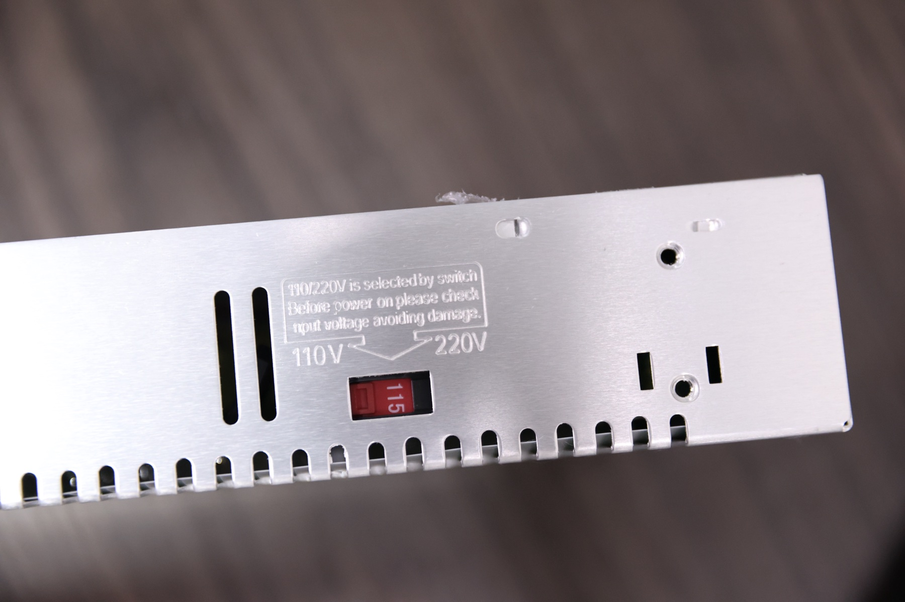

Before plugging in the power supply, check that:

- The voltage selector is set correctly for your country or region.
- In the US, the selector must be set to **110V**.
- The power supply is still unplugged while you check or change the selector.
